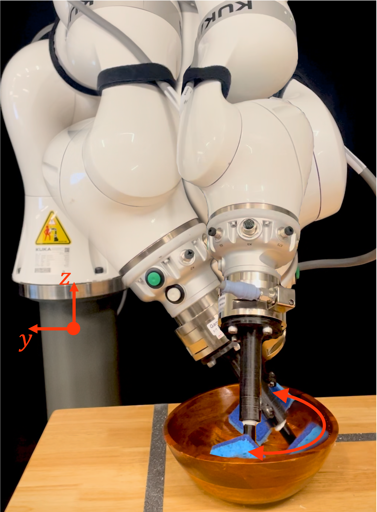

# A Physically Consistent Stiffness Formulation for Contact-Rich Manipulation 

**Johannes Lachner1,2, Moses C. Nah1, and Neville Hogan1,2**  

¹ Department of Mechanical Engineering, Massachusetts Institute of Technology, Cambridge, USA  
² Department of Brain and Cognitive Sciences, Massachusetts Institute of Technology, Cambridge, USA  

  
  

  <b>Left:</b> Overlaid robot configurations during the parkour experiments.
  <b>Right:</b> Overlaid robot configurations and directions during the bowl-wiping experiments.

## Abstract  
Ensuring symmetric stiffness in impedance-controlled robots is crucial for physically meaningful and stable interaction
in contact-rich manipulation. Conventional approaches neglect the change of basis vectors in curved spaces, leading
to an asymmetric joint-space stiffness matrix that violates passivity and conservation principles. In this work, we derive
a physically consistent, symmetric joint-space stiffness formulation directly from the task-space stiffness matrix by
explicitly incorporating Christoffel symbols. This correction resolves long-standing inconsistencies in stiffness modeling,
ensuring energy conservation and stability. We validate our approach experimentally on a robotic system, demonstrating
that omitting these correction terms results in significant asymmetric stiffness errors. Our findings bridge theoretical
insights with practical control applications, offering a robust framework for stable and interpretable robotic interactions.

## Repository Structure  

- `/FRI_ClientApplication/` – Client-side application for interfacing with the KUKA LBR robot  
  - `/trajectory_csv/` – Recorded joint trajectory data  
  - `/src/` – Source code for implementing the stiffness formulation  
    - `MyLBRClient.cpp/.h` – Core implementation for the LBR robot client  
    - `my_diff_jacobians.cpp/.h` – Differential Jacobians for stiffness computation  
    - `MyLBRApp.cpp` – Application entry point  
    - `CMakeLists.txt` – Build configuration for CMake  

- `/Matlab/` – MATLAB scripts for analysis, visualization, and validation  
  - `/Experiment1/` – Scripts for Experiment 1: Parkour
  - `/Experiment2/` – Scripts for Experiment 1: Wiping a bowl  

- `LICENSE` – Licensing information  
- `README.md` – This document  

## Requirements  

### C++  
- **Eigen** (matrix and vector computations)  
- **Boost** (threading and timing utilities)  
- **[Explicit-FRI](https://github.com/explicit-robotics/Explicit-FRI)** (KUKA Fast Research Interface implementation)

### MATLAB  
- MATLAB R2020b or newer  
- **[Explicit-MATLAB](https://github.com/explicit-robotics/Explicit-MATLAB)** (for data processing and analysis)

## Explicit-MATLAB & Explicit-FRI  
This repository utilizes **Explicit-MATLAB** and **Explicit-FRI** for robot interaction and analysis.  
For more information, visit: [Explicit Robotics](https://explicit-robotics.github.io/).

## Citation  
If you use this repository, please cite our paper:

    J. Lachner, M. C. Nah, and N. Hogan, "A Physically Consistent Stiffness Formulation for Contact-Rich Manipulation," arXiv, 2025.